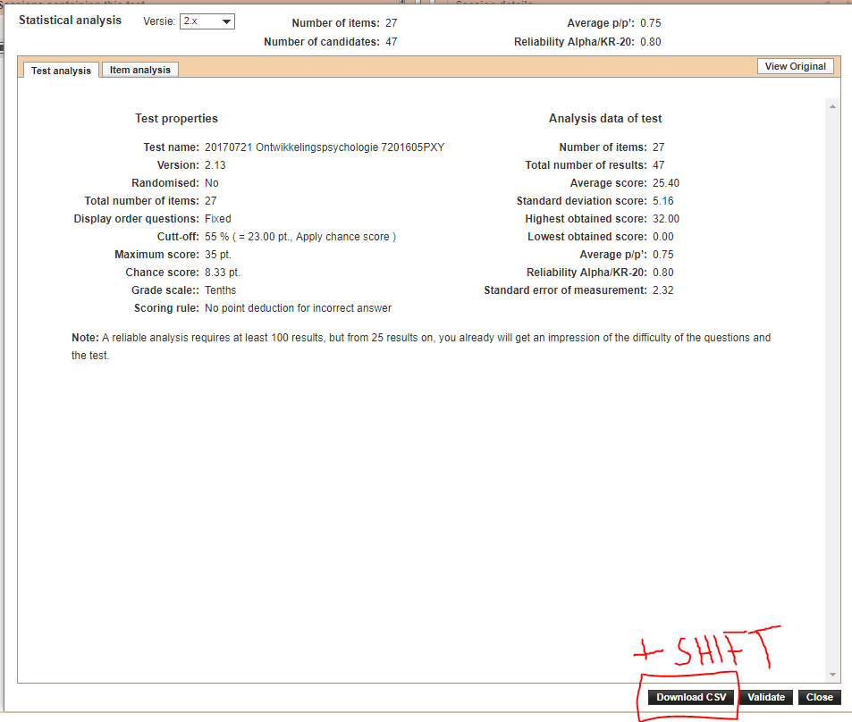

# Stappenplan voor gebruik:

## Download resultaten uit Testvision

1. Ga via **Gepubliceerde toetsen** naar het tentamen. 
2. Druk op **Analysis** 
3. Druk op **Download CSV** en houd daarbij **SHIFT** ingedrukt. 

## Verwerken file in R

1. Gebruik onderstaand script om de berekeningen te maken. Vul de input en output file path in! 

```{r, error=FALSE,warning=FALSE,message=FALSE}
rm(list = ls())

#### HIER HET PAD NAAR DE INPUT FILE INVULLEN ####

data <- 
  read.table(file = "input/20171110 WSR Deeltoets 2 7202A609XY-2.csv",header = FALSE,as.is = TRUE,fill = TRUE,sep = ",", comment.char = "",quote = "\"")

# Extract correct answers

# Get raw correct answer row. 
correct_answer <- 
  unlist(data[which(data$V2 == "Naam cursist"),3:dim(data)[2]])

# Get raw question name row.
question_name <- 
  unlist(data[which(data$V2 == "QId"),3:dim(data)[2]])

# Raw correct answer row
max_answer_alternative <- 
  unlist(data[which(data$V2 == "Uiterste"),3:dim(data)[2]])

# Raw question names and answers. 
# Look up the first 1 in the first column, start taking every second row till the end. 
names_and_answers <-
  data[seq(which(data$V1 == 1)[1], dim(data)[1],by = 2),2:dim(data)[2]]

# Student names
names <- names_and_answers$V2

# Just answers
answers <- names_and_answers[ , -1]

names(answers) <- question_name

# All answer columns consisting only of NA
mc_columns <- which(grepl("[A-Z]{1}",correct_answer))
question_name_columns <- which(grepl("[A-Z]",question_name))

open_question_columns <- question_name_columns[!(question_name_columns %in% mc_columns)]

# Stop if no mc questions.

checkForMc <- function(mc_columns) if(length(mc_columns) == 0) stop("NO MC QUESTIONS")
checkForMc(mc_columns)

other_columns <- open_question_columns -1 

# if(any(other_columns == 1)){
#  other_columns <- other_columns[-which(other_columns == 1)]
# }

# Calculating the total score
mc_answers <- answers[ , mc_columns]
correct_answer_only <- correct_answer[mc_columns]
sum_scored_mc_answers <- apply(t(t(mc_answers) == correct_answer_only),1, sum)

sum_other_answers <- rowSums(sapply(answers[ , other_columns],as.numeric))

# Do not add other answers if there are none. 

if(any(is.na(sum_other_answers))) {
  total_score = sum_scored_mc_answers
} else {
   total_score = sum_other_answers + sum_scored_mc_answers
}


# Calculating the RAT

max_answer_alternative_filtered <-
  max_answer_alternative[mc_columns]

possible_mc_answer_factor_levels <- list()

for (i in seq_along(max_answer_alternative_filtered)) {
  possible_mc_answer_factor_levels[[i]] <-
    LETTERS[1:which(LETTERS == max_answer_alternative_filtered[i])]
}

mc_answers_factorized <- mc_answers

for (i in seq_along(mc_answers[1,])) {
  mc_answers_factorized[, i] <-
  factor(mc_answers[, i], levels = possible_mc_answer_factor_levels[[i]])
}

rat_values <- possible_mc_answer_factor_levels

# Calculating RAT score for each answer category.

for (i in seq_along(mc_answers[1, ])) {
  for (j in seq_along(possible_mc_answer_factor_levels[[i]])) {
    rat_values[[i]][j] <-
    round(cor(
    mc_answers[, i] == possible_mc_answer_factor_levels[[i]][j], total_score),3)
  }
  
}

# Store in data.frame

length_answer_alternatives <- unlist(lapply(possible_mc_answer_factor_levels, length))

result <- matrix(NA,nrow = max(length_answer_alternatives), ncol=length(names(mc_answers)))
colnames(result) = names(mc_answers)
rownames(result) = LETTERS[1:max(length_answer_alternatives)]

for(i in seq_along(result[1, ])) {
  result[1:length(rat_values[[i]]) , i] = rat_values[[i]]
}
 
result <- as.data.frame(result)

names(result) <- paste0(names(result)," Correct:(",correct_answer_only,")")

#### HIER HET PAD NAAR DE GEWENSTE OUTPUT FILE INVULLEN ####
write.csv(result, "output/RAT_values.csv")
 
```

# Uitleg over output:

De output file zou als volgt uit moeten zien: 

De kolomnaam geeft de naam van de vraag weer. De correcte antwoord staat aan het einde. 
De linker kolom geeft de antwoordoptie weer.
Indien er een missing value staat komt dat door het ontbreken van de gegeven antwoord. Dit kan omdat niemand de antwoordoptie 
heeft gekozen, of omdat de vraag niet alle antwoordopties bevat. 
Let op: De vraag met de meeste antwoord opties bepaald hoe veel antwoordopties in de linker kolom komen te staan. 
Vraag 1 zou dus A B en C als mogelijke antwoord opties kunnen hebben staan, terwijl dat bij vraag 2 alleen A en B zijn.
Bij vraag 2 komt dan bij C een NA te staan.


